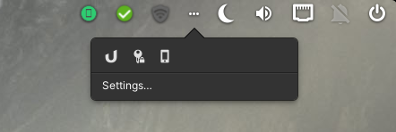

# Wingpanel Community Indicators (Ayatana support)

 

This fork combines <b>ayatana indicators</b> with the <b>namarupa</b> project, giving the user <b>more freedom of decision</b>, which indicators should be presented where while keeping <b>compatibility</b> with ubuntu/unity indicators on <b>elementary OS</b> (Pantheon) wingpanel.

I am currently working on a switchboard-plug this project lives in symbiosis with.

<b>If you want to use community-indicators, please also <a href="https://github.com/MvBonin/switchboard-plug-indicators">install MvBonin/switchboard-plug-indicators from here!</a></b>

This adds support for all kinds of different indicators, like Steam, Nextcloud, KeePassXC and lots more.
It is <b>currently under developement and subject to change a lot. Use it at your own risk and update it often.</b>

 ## Build and install:
First install the <b>dependencies</b> listed below.

Open a Terminal in the extracted folder, <b>build</b> your application with meson and <b>install</b> it with ninja: 

<pre>meson build --prefix=/usr
cd build
ninja
sudo ninja install
</pre>
Make sure, you follow the instructions in <b>"Parameters for Pantheon"</b>. Otherwise it might not work.

<h1></h1>

  
<b>Dependencies:</b> 

  You'll need the following dependencies :

<pre>sudo apt-get install valac gcc meson 
sudo apt-get install libglib2.0-dev libgranite-dev libindicator3-dev libjson-glib-dev </pre>

- Version Hera (5) and previous :  
  <pre>sudo apt-get install libwingpanel-2.0-dev</pre>

- Version Odin(6) and later:   
  <pre>sudo apt-get install libwingpanel-dev indicator-application</pre>

  
<b>Parameters for Pantheon (eOS)</b>

  You need to add Pantheon to the list of desktops abled to work with indicators.

  There are two ways to do it, so just choose one: 
<ul>
<li><b>1. - Manually with autostart (thanks to JMoerman):</b></li>
just add the following custom command to auto start in 

System settings -> "Applications" -> "Startup" -> "Add Startup App…" -> "Type in a custom command".
<pre>/usr/lib/x86_64-linux-gnu/indicator-application/indicator-application-service</pre> 
Now you need to change a file:
<pre>sudo nano /etc/xdg/autostart/indicator-application.desktop</pre>
Search the parameter: OnlyShowIn= and add "Pantheon" at the end of the line : 
<pre>OnlyShowIn=Unity;GNOME;Pantheon;</pre>
Save your changes (Ctrl+X to quit + Y(es) to save the changes + Enter to validate the filename). 

<li><b>2. - With the terminal (thanks to ankurk91):</b></li>
Open Terminal and run the following commands.
<pre>mkdir -p ~/.config/autostart
cp /etc/xdg/autostart/indicator-application.desktop ~/.config/autostart/
sed -i 's/^OnlyShowIn.*/OnlyShowIn=Unity;GNOME;Pantheon;/' ~/.config/autostart/indicator-application.desktop</pre>
</ul>

<b>For changes to take effect you need to reboot your machine.</b>

  
<b>How to uninstall community-indicators</b>

### If you want to <b>uninstall</b> it, open a terminal in the build folder.
<pre>sudo ninja uninstall</pre>

  
<b>How to restart wingpanel</b>

### To restart wingpanel:

Version Hera(5) and previous:  <pre>killall wingpanel</pre>

Version Odin(6): <pre>killall io.elementary.wingpanel</pre>

